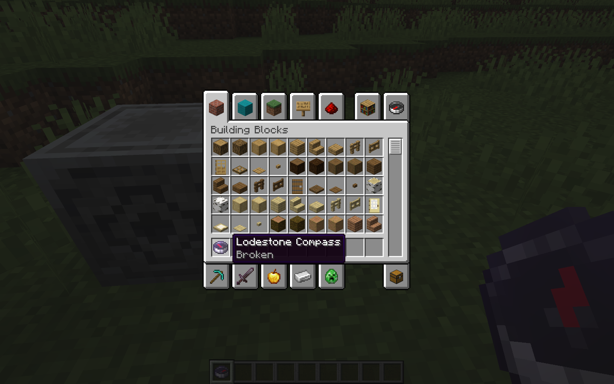

# Broken Compass Tooltip

A Fabric Minecraft mod that adds server-side tooltips for broken lodestone compasses:

This allows you to differentiate between broken compasses and ones pointing to other dimensions, as they both spin randomly:

## Dependencies

- [Fabric 0.19.5](https://fabricmc.net/use)
- [Fabric API 0.161.0+26.2](https://modrinth.com/mod/fabric-api/version/0.161.0+26.2)

## Installation

Jars are available on [Modrinth](https://modrinth.com/mod/broken-compass-tooltip) or [GitHub Releases](https://github.com/tommy-mitchell/broken-compass-tooltip/releases/latest).
